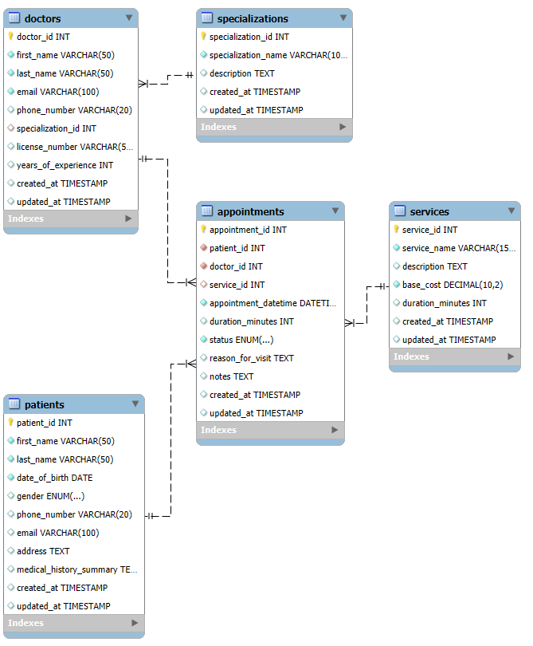

# clinic_booking_system

# Clinic Booking System Database

## Project Description

This project implements a relational database for a **Clinic Booking System** using MySQL. The database is designed to manage key entities such as patients, doctors, medical specializations, offered services, and appointments. It facilitates scheduling, tracking patient history (summary), managing doctor specializations, and recording services provided during appointments.

The schema includes tables with appropriate primary keys, foreign keys to enforce relationships, `NOT NULL` constraints for essential data, `UNIQUE` constraints for fields like emails and phone numbers, and `ENUM` types for predefined value sets.

## Database Structure (Entities & Relationships)

The main entities and their relationships are:

*   **Specializations**: Stores different medical specializations (e.g., Cardiology, Dermatology).
    *   *One Specialization can have Many Doctors.*
*   **Services**: Stores medical services offered by the clinic (e.g., General Consultation, ECG Test), including their base cost and typical duration.
    *   *One Service can be associated with Many Appointments.*
*   **Patients**: Stores information about the clinic's patients.
    *   *One Patient can have Many Appointments.*
*   **Doctors**: Stores information about the doctors, including their assigned specialization.
    *   *One Doctor can have Many Appointments.*
    *   *One Doctor belongs to One Specialization (or none if `specialization_id` is NULL).*
*   **Appointments**: The central table that links patients, doctors, and services for scheduled visits. It includes appointment date/time, status, reason for visit, and notes.
    *   *Many-to-One with Patients.*
    *   *Many-to-One with Doctors.*
    *   *Many-to-One with Services (optional).*

## How to Run/Setup the Project

1.  **Prerequisites**:
    *   MySQL Server installed and running.
    *   A MySQL client (e.g., MySQL Workbench, DBeaver, `mysql` command-line tool).

2.  **Setup Steps**:
    *   **Clone the repository (or download the `.sql` file).**
    *   **Create a new database (optional but recommended):**
        Open your MySQL client and run:
        ```sql
        CREATE DATABASE clinic_db;
        ```
    *   **Use the database:**
        ```sql
        USE clinic_db;
        ```
    *   **Execute the SQL script:**
        Run the `clinic_booking_system.sql` file provided in this repository.
        If using the command line:
        ```bash
        mysql -u your_username -p clinic_db < clinic_booking_system.sql
        ```
        (Replace `your_username` with your MySQL username. You will be prompted for your password.)
        Alternatively, open the `.sql` file in your MySQL client and execute its contents.

3.  **Verification**:
    After execution, you can verify the table creation by running:
    ```sql
    SHOW TABLES;
    ```
    And inspect individual table structures:
    ```sql
    DESCRIBE Patients;
    DESCRIBE Appointments;
    -- etc.
    ```

## Entity-Relationship Diagram (ERD)

Below is a conceptual ERD for the Clinic Booking System.


**Conceptual ERD Description:**

*   `Specializations` --1:M-- `Doctors` (A doctor has one specialization)
*   `Patients` --1:M-- `Appointments` (A patient can have many appointments)
*   `Doctors` --1:M-- `Appointments` (A doctor can have many appointments)
*   `Services` --1:M-- `Appointments` (An appointment can be for one primary service)


## Entity-Relationship Diagram (ERD)

